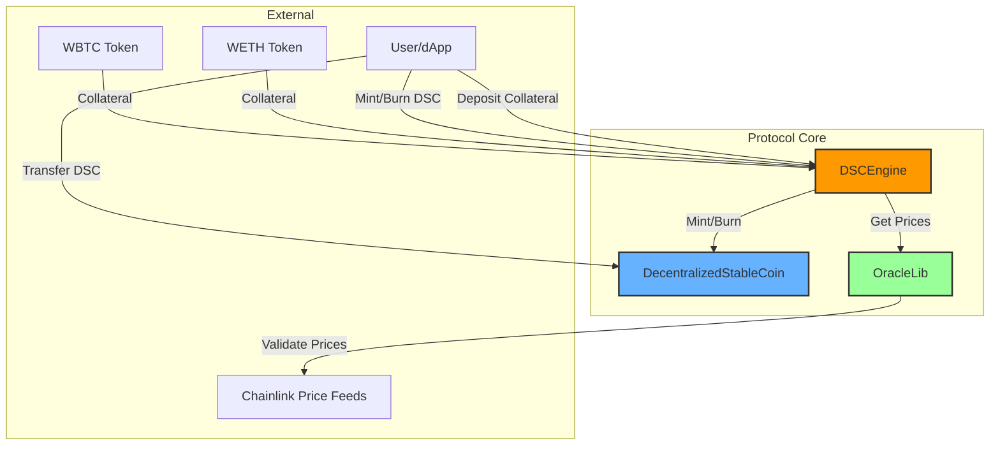

# 🪙 Decentralized Stablecoin Protocol

A robust, overcollateralized stablecoin protocol built on the Ethereum blockchain, featuring algorithmic stability and exogenous collateral backing. 💎

## 🔍 Overview

This protocol implements a decentralized stablecoin (DSC) pegged to USD, backed by cryptocurrency collateral (wETH and wBTC). The system is designed with the following key properties:

1. **Relative Stability**: Pegged to USD through Chainlink Price Feeds 📈
2. **Stability Mechanism**: Algorithmic with coded collateralization rules ⚙️
3. **Collateral Type**: Exogenous (wETH, wBTC) 🔐
4. **Minimum Collateralization Ratio**: 200% 💪
5. **Liquidation Threshold**: 50% of collateral value ⚠️

## 🏗️ Technical Architecture

### 📊 System Architecture Diagram



1. **DSCEngine.sol**

   - Main protocol logic
   - Handles collateral deposits/withdrawals
   - Manages minting/burning of DSC
   - Implements liquidation mechanics
   - Maintains health factors

2. **DecentralizedStableCoin.sol**

   - ERC20 implementation
   - Controlled minting/burning mechanics
   - Owner-only operations

3. **OracleLib.sol**
   - Price feed management
   - Stale price protection
   - Chainlink integration

### ⭐ Key Features ⭐

- **Overcollateralization**: Always maintains >100% collateral backing 💰
- **Liquidation System**: Automated position management with bonus incentives 🤖
- **Price Oracle Integration**: Real-time price feeds with staleness checks 📊
- **Reentrancy Protection**: Secure against common attack vectors 🛡️
- **Modular Design**: Separated concerns for maintainability 🧩

### 🔒 Security Measures

- Comprehensive test suite including:
  - Unit tests ✅
  - Integration tests 🔄
  - Fuzz testing with invariant checks 🎲
  - Failure case handling ⛓️‍💥
- Multiple security patterns:
  - Checks-Effects-Interactions pattern
  - Pull over push payments
  - Guard checks
  - Reentrancy guards

## 🧪 Testing & Quality Assurance

The protocol includes extensive testing infrastructure:

- **Invariant Tests**: Ensuring system-wide properties hold under any conditions
- **Fuzz Testing**: Random input testing with both fail-on-revert and continue-on-revert strategies
- **Integration Tests**: Complete system interaction verification
- **Mock Contracts**: Thorough edge case testing

## 📋 Technical Specifications

- Solidity Version: 0.8.19
- Framework: Foundry
- Dependencies: OpenZeppelin, Chainlink

## 💡 Development Highlights

- Clean, well-documented code following best practices
- Extensive commenting for maintainability
- Gas-optimized operations ⚡
- Modular architecture for upgradability
- Comprehensive error handling

## 👨‍💻 For Developers

### 🎯 Getting Started

1. Clone the repository

```bash
git clone https://github.com/SquilliamX/Foundry-Defi-Stablecoin.git
```

2. Install dependencies

```bash
forge install
```

3. Run tests

```bash
forge test
```

4. Run specific test file

```bash
forge test --mt <name_of_test>
```

5. Run coverage report

```bash
forge coverage
```

## 🛡️ Security Considerations

This protocol has been designed with security as a primary concern, implementing:

- Rigorous input validation
- Secure math operations
- Access controls
- Price feed validation
- Emergency pause functionality

### ⚠️ Known Considerations

1. Chainlink oracle dependency
2. Market volatility risks
3. Liquidation threshold parameters
4. Price feed staleness checks
5. Collateral value fluctuations

## 💫 Inspiration

This protocol draws inspiration from successful stablecoin systems like MakerDAO while implementing unique features and improvements. It's designed to be minimal yet robust, focusing on core functionality and security.

## 🤝 Contributing

Contributions are welcome! Please feel free to submit a Pull Request. For major changes, please open an issue first to discuss what you would like to change.

Please make sure to update tests as appropriate.

## 📜 License

This project is licensed under the MIT License

---

_Note: This protocol is a demonstration of advanced Solidity development practices and should not be used in production without thorough auditing._ ⚠️

Built with ❤️ by Squilliam
